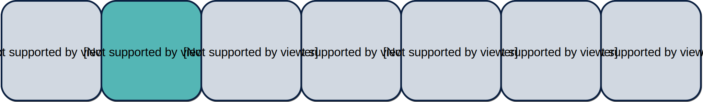

<!--
author:   Stina Schäfer, Lennart Rosseburg für twillo

email:    support.twillo@tib.eu

repository: https://github.com/twillo-lehre-teilen/BestPractice_Sortieralgorithmen/tree/master

comment:  Eine Selbstlerneinheit mit interaktiven Programmieraufgaben für die gängigsten Sortieralgorithmen. Diese Seite ist lizenziert unter der [Lizenz CC-BY-SA (3.0)](https://creativecommons.org/licenses/by-sa/3.0/legalcode).

language: de

mode:     Textbook

version:  1.0.0

date:     07/02/2022

icon:     https://cdn.jsdelivr.net/gh/twillo-lehre-teilen/BestPractice_Sortieralgorithmen/docs/twillo_logo.svg

logo:     https://cdn.jsdelivr.net/gh/twillo-lehre-teilen/BestPractice_Sortieralgorithmen/docs/twillo_logo.png

link:     https://cdn.jsdelivr.net/gh/twillo-lehre-teilen/BestPractice_Sortieralgorithmen/custom.css

import:   https://github.com/LiaTemplates/Pyodide/blob/0.1.4/README.md
          https://github.com/LiaScript/CodeRunner/blob/master/README.md

@eval:  @LIA.eval(`["main.py"]`, `python -m compileall .`, `python main.pyc`)
-->
<!--
Pyodide:
- use @eval only for single code-blocks
- for multiple code-blocks define own @LIA.eval()
-->

# Sortieralgorithmen

> # Lizenzhinweis
>
> Der Kurs *Sortieralgorithmen*, von Stina Schäfer & Lennart Rosseburg für twillo, ist lizenziert unter der [Lizenz CC-BY-SA (3.0)](https://creativecommons.org/licenses/by-sa/3.0/legalcode).
>
> #### Unter Nutzung von
>
> - Dem [Kapitel "Sortieren"](https://de.wikiversity.org/wiki/Kurs:Algorithmen_und_Datenstrukturen/Vorlesung/Sortieren) aus dem [Kurs "Algorithmen und Datenstrukturen"](https://de.wikiversity.org/wiki/Kurs:Algorithmen_und_Datenstrukturen), von Wikiversity unter der Beteiligung folgender [Autor:innen](https://de.wikiversity.org/w/index.php?title=Kurs:Algorithmen_und_Datenstrukturen/Vorlesung/Sortieren_Grundlagen&action=history), unter der [Lizenz CC-BY-SA (3.0)](https://creativecommons.org/licenses/by-sa/3.0/legalcode).
>
> - Dem ["Kurs: Diskrete Mathematik (Osnabrück 2020)/Vorlesung 7"](https://de.wikiversity.org/wiki/Kurs:Diskrete_Mathematik_%28Osnabr%C3%BCck_2020%29/Vorlesung_7), von Wikiversity unter der Beteiligung folgender [Autor:innen](https://de.wikiversity.org/w/index.php?title=Kurs:Diskrete_Mathematik_%28Osnabr%C3%BCck_2020%29/Vorlesung_7&action=history), unter der [Lizenz CC-BY-SA (3.0)](https://creativecommons.org/licenses/by-sa/3.0/legalcode).

Diese Selbstlerneinheit konzentriert sich auf die Funktionsweise grundlegender Sortieralgorithmen und enthält interaktive Programmiereinheiten um das Gelernte durch eigene Anwendung zu verinnerlichen.

<!--  style="background-color:#A6D492;" -->
> #### Ziel des Kurses:
>
> Am Ende dieser Selbstlerneinheit sollten Sie die vorgestellten Sortieralgorithmen unterscheiden, in den Kontext von Sortierungsproblemen in der Informatik einordnen und selbst anwenden können.

## Grundlagen

Diese Lektion gibt eine grundlegende Einführung in das Thema Sortieren und Sortieralgorithmen. Sortieren ist ein grundlegendes Problem in der Informatik. Es beinhaltet das Ordnen von Datensätzen, die Schlüssel enthalten und das Umordnen der Datensätze, so, dass eine klar definierte Ordnung der Schlüssel (z.B. numerisch/alphabetisch) besteht. Eine Vereinfachung ist die Betrachtung der Schlüssel, z.B. ein Array von ganzen Zahlen.

#### Ordnungen und Schlüssel

<!--  style="background-color:#A6D492;" -->
> # Ziel dieses Kapitels
>
> Dieses Kapitel soll Sie in die Lage versetzen Sortieren als Problem in der Informatik beschreiben und einordnen zu können. Sie sollten verstanden haben was eine Ordnung und was Schlüssel sind und welche Rolle sie beim Sortieren spielen.

Um die Elemente einer Menge zu sortieren, müssen wir diese miteinander vergleichen können. Dies erreichen wir, indem wir eine Ordnung auf den zu sortierenden Elementen definieren. Ein einfaches und häufig genutztes Beispiel für eine Ordnung ist das übliche $\leq$ auf den natürlichen Zahlen.

<!--  style="background-color:#F0F2F6;" -->
> # Ordnung
>
> Eine Relation $\leq$ auf einer Menge $I$ heißt Ordnungsrelation oder Ordnung, wenn folgende drei Bedingungen erfüllt sind:
>
> - Reflexivität: $x \leq x$ $\forall x \in I$
> - Transitivität: $x \leq y \land y \leq z \to x \leq z$ $ \forall x,y,z \in I$
> - Antisymmetrie: $x \leq y \land y \leq x \to x = y$ $ \forall x,y \in I $

Weitere nützliche Begriffe im Zusammenhang mit Ordnungen sind:

<!--  style="background-color:#F0F2F6;" -->
> # Strikter Anteil einer Ordnungsrelation $\leq$
>
> $x < y := x \leq y \land x \neq y$

<!--  style="background-color:#F0F2F6;" -->
> # Totale Ordnung
>
> Eine Ordnungsrelation $\leq$ auf einer Menge $I$ heißt totale Ordnung (oder lineare Ordnung), wenn zu je zwei Elementen $x,y \in I$ die Beziehung $x\leq y$ oder $y\leq x$ gilt.
>
> Man sagt auch, dass bei einer linearen Ordnung je zwei Elemente vergleichbar sind.

<!--  style="background-color:#F0F2F6;" -->
> # Schlüssel
>
> Da die zu sortierenden Elemente alles mögliche und damit oft schwer zu vergleichen sein können, verwendet man Schlüssel. Jedes Element hat einen festen Schlüssel (häufig ganze Zahlen) und die Ordnung wird dann auf den Schlüsseln definiert. Ein Beispiel hierfür sind Chipnummern für Haustiere, die ohne diese Nummern wohl schwer zu sortieren wären. Ein anderes Beispiel wäre die Mitgliederliste eines Schachvereins, die ihre Mitglieder nach Nachnamen sortiert auflistet. Der Schlüssel ist hierbei jeweils der Nachname der Person, die Ordnung die alphabetische Ordnung.

#### Sortieralgorithmen - Problembeschreibung

Als Eingabe haben wir eine Folge von Elementen $\langle a_1,. . . , a_n\rangle$. Als Ausgabe haben wir die Permutation $\langle a'_{1},...,a'_{n}\rangle$ der gleichen Elemente mit der Eigenschaft $a'_{1}\leq a'_{2}\leq ,...,a'_{n}$.

Die Sortierung erfolgt anhand eines Schlüssels, z.B. ganzen Zahlen. Jedes zu sortierende Element hat dabei einen festen Schlüssel und die Schlüssel lassen sich mittels einer Ordnungsrelation vergleichen (und somit sortieren). Wie genau die Datenstruktur aussieht auf der sortiert wird, hat natürlich Auswirkungen auf Praktikabilität und Laufzeit, ist für die grundlegende Funktionsweise des Algorithmus aber erst einmal unwichtig.

#### Quiz

<!-- style="background-color:lightblue;" -->
> # Bedienungsanleitung des Quiz:
>
> Damit beim Quiz Ihr Punktestand berechnet werden kann, müssen folgende Schritte absolviert werden:
>
> 1. Führen Sie den Code-Block mit der Beschriftung <b>"Ausführen zur Punkteberechnung"</b> aus. Dafür müssen Sie den kleinen Button links unterhalb des Code-Blocks anklicken.
> 2. Um das Quiz zu starten klicken Sie auf den Button <b>"Quiz starten!"</b>.
> 3. Beantworten Sie nun alle Fragen im Quiz.
> 4. Um das Quiz zu beenden klicken Sie auf den Button <b>"Quiz beenden!"</b>. Ihr Endpunktestand wird Ihnen unterhalb des Code-Blocks mitgeteilt.


<lia-keep>
<button type="button" id="start" class="quiz">Quiz starten!</button>
<button type="button" id="stop" class="quiz">Quiz beenden!</button>
<br><br>
</lia-keep>

<!-- data-readOnly="true" style="display:block;" -->
``` js -Ausführen zur Punkteberechnung

let quiz_started = false;
let points = 0;

function start(){
  if(!quiz_started){   
    points = 0;
    quiz_started = true;
    console.warn("Das Quiz wurde gestartet!");
  }
}

function stop(){
  if(quiz_started){
    quiz_started = false;
    console.warn("Quiz beendet!");
    document.getElementById("start").removeEventListener("click", start);
    document.getElementById("stop").removeEventListener("click", stop);
    document.getElementById("Ergebnis").innerHTML="Dein Endpunktestand ist: " + points;
    document.getElementById("Ergebnis").style.display="inline-block";
    send.lia("LIA: stop");
  } else {
    console.warn("Quiz wurde noch nicht gestartet!");
  }
}

document.getElementById("start").addEventListener("click", start);
document.getElementById("stop").addEventListener("click", stop);

send.register("q1", function(e){
  if(quiz_started){
    if(e == "t"){
      points += 1;
    } else {
      points -= 1;
    }
    //console.warn("Your current score is:", points);
  }
});
send.register("q2", function(e){
  if(quiz_started){
    if(e == "t"){
      points += 1;
    } else {
      points -= 1;
    }
    //console.warn("Your current score is:", points);
  }
});
send.register("q3", function(e){
  if(quiz_started){
    if(e == "t"){
      points += 1;
    } else {
      points -= 1;
    }
    //console.warn("Your current score is:", points);
  }
});
send.register("q4", function(e){
  if(quiz_started){
    if(e == "t"){
      points += 1;
    } else {
      points -= 1;
    }
    //console.warn("Your current score is:", points);
  }
});
send.register("q5", function(e){
  if(quiz_started){
    if(e == "t"){
      points += 1;
    } else {
      points -= 1;
    }
    //console.warn("Your current score is:", points);
  }
});
send.register("q6", function(e){
  if(quiz_started){
    if(e == "t"){
      points += 1;
    } else {
      points -= 1;
    }
    //console.warn("Your current score is:", points);
  }
});
send.register("q7", function(e){
  if(quiz_started){
    if(e == "t"){
      points += 1;
    } else {
      points -= 1;
    }
    //console.warn("Your current score is:", points);
  }
});
send.register("q8", function(e){
  if(quiz_started){
    if(e == "t"){
      points += 1;
    } else {
      points -= 1;
    }
    //console.warn("Your current score is:", points);
  }
});
send.register("q9", function(e){
  if(quiz_started){
    if(e == "t"){
      points += 1;
    } else {
      points -= 1;
    }
    //console.warn("Your current score is:", points);
  }
});

"LIA: wait";
```
<script>@input</script>

<lia-keep>
<div id="Ergebnis" class="ergebnis">
</div>
</lia-keep>

<!--  style="background-color: #A6D492;" -->
> # Punktevergabe:
>
> - Für jede richtige Antwort gibt es einen Punkt.
> - Für jede falsche Antwort (<b>pro Versuch</b>) wird ein Punkt abgezogen.
>
> Es können <b>maximal 9 Punkte</b> erzielt werden. Dies ist nur möglich, wenn jede Frage mit dem <b>1. Versuch</b> richtig beantwortet wird!

**Schreiben Sie die richtige Antwort in die vorgegebenen Textfelder. Achten Sie dabei auf Gross- und Kleinschreibung.**

1. Welche Bedingung muss eine Relation neben der Transitivität und der Antisymmetrie erfüllen, damit sie eine Ordnung genannt werden kann?

    [[Reflexivität]]
    <script>
      if("@input" == "Reflexivität"){
        send.lia("true");
        send.dispatch("q1", "t");
      }else{
        send.lia("false");
        send.dispatch("q1", "f");
      }
      "LIA: stop"
    </script>

2. Durch was werden Elemente einer Menge eindeutig identifiziert?

    [[Schlüssel]]
    <script>
      if("@input" == "Schlüssel"){
        send.lia("true");
        send.dispatch("q2", "t");
      }else{
        send.lia("false");
        send.dispatch("q2", "f");
      }
      "LIA: stop"
    </script>

**Sind die folgenden Aussagen wahr oder falsch?**

3. Ordnungen sind nur über Mengen von Zahlen, z.B. $\N$, definiert.

    [( )] wahr
    [(x)] falsch
    <script>
      if("@input" == 1){
        send.lia("true");
        send.dispatch("q3", "t");
      }else{
        send.lia("false");
        send.dispatch("q3", "f");
      }
      "LIA: stop"
    </script>
    ******************

    - Ordnungen können z.B. auch über Mengen von Buchstaben definiert sein.

    *************


4. Schlüssel müssen nicht eindeutig sein, d.h. zwei Elemente können den gleichen Schlüssel haben.

    [( )] wahr
    [(X)] falsch
    <script>
      if("@input" == 0){
        send.lia("true");
        send.dispatch("q4", "t");
      }else{
        send.lia("false");
        send.dispatch("q4", "f");
      }
      "LIA: stop"
    </script>
    ***********

    - Schlüssel müssen definitionsgemäß eindeutig sein, damit Elemente eindeutig identifizierbar sind.

    ***********

5. Der Schlüssel eines Elements kann sich während des Sortierens ändern.

    [( )] wahr
    [(x)] falsch
    <script>
      if("@input" == 1){
        send.lia("true");
        send.dispatch("q5", "t");
      }else{
        send.lia("false");
        send.dispatch("q5", "f");
      }
      "LIA: stop"
    </script>
    ************

    - Jedes Element hat einen festen Schlüssel. Gäbe es variable Schlüssel könnte keine Ordnung darauf definiert werden.

    ***********

**Sei nun $\leq$ die Ordnungsrelation auf den natürlichen Zahlen $\N$.**

6. Welche der folgenden Aussagen sind richtig?

    [[ ]] $\leq$ ist keine lineare Ordnung.
    [[x]] Es gilt $x \leq x$ $\forall x \in I$
    [[x]] $\leq$ ist eine totale Ordnung.
    <script>
      if("@input" == "[0,1,1]"){
        send.lia("true");
        send.dispatch("q6", "t");
      }else{
        send.lia("false");
        send.dispatch("q6", "f");
      }
      "LIA: stop"
    </script>
    **************

    - Eine totale Ordnung ist dasselbe wie eine lineare Ordnung.

    **************

7. Es gilt $x \leq y \land z \leq y \to x \leq z$ $ \forall x,y,z \in \N$

    [( )] wahr
    [(x)] falsch
    <script>
      if("@input" == 1){
        send.lia("true");
        send.dispatch("q7", "t");
      }else{
        send.lia("false");
        send.dispatch("q7", "f");
      }
      "LIA: stop"
    </script>
    **************************

    - Das $x \leq y \land z \leq y$ gilt gibt uns keinen Hinweis darüber, ob auch $x \leq z$ gilt.

    **************************

8. Der strikte Anteil von $\leq$ ist:

    $x < y := x \leq y \lor x \neq y$

    [( )] wahr
    [(X)] falsch
    <script>
      if("@input" == 1){
        send.lia("true");
        send.dispatch("q8", "t");
      }else{
        send.lia("false");
        send.dispatch("q8", "f");
      }
      "LIA: stop"
    </script>
    **************************

    - Der strikte Anteil von $\leq$ ist: $x < y := x \leq y \land x \neq y$

    **************************

**Wählen Sie die richtige Antwortmöglichkeit aus.**

9. Welche Relation wird durch folgende Gleichung beschrieben?

    $x \leq y \land y \leq z \to x \leq z$ $ \forall x,y,z \in I$

    [[ Reflexivität | (Transitivität) | Antisymmetrie ]]
    <script>
      if("@input" == 1){
        send.lia("true");
        send.dispatch("q9", "t");
      }else{
        send.lia("false");
        send.dispatch("q9", "f");
      }
      "LIA: stop"
    </script>
    **********

    - Die anderen beiden Relationen, die von einer Ordnung erfüllt sind, werden durch folgende Gleichungen beschrieben:

      - Reflexivität: $x \leq x$ $\forall x \in I$
      - Antisymmetrie: $x \leq y \land y \leq x \to x = y$ $ \forall x,y \in I $

    **********


## InsertionSort

<!--  style="background-color:#A6D492;" -->
> ## Ziel dieses Kapitels:
>
> Nach diesem Kapitel sollten Sie die Vorgehensweise von InsertionSort verstanden haben, sowie die einzelnen Schritte benennen und anwenden können. Außerdem sollten Sie in der Lage sein den Algorithmus schrittweise zu implementieren.

#### Grundlegende Idee

Dieses Kapitel behandelt die Sortiermethode InsertionSort oder auch "Sortieren durch Einfügen" genannt. Die Idee des Algorithmus ist, die typische menschliche Vorgehensweise, etwa beim Sortieren eines Stapels von Karten umzusetzen. Das heißt es wird mit der ersten Karte ein neuer Stapel gestartet. Anschließend nimmt man jeweils die nächste Karte des Originalstapels und fügt diese an der richtigen Stelle im neuen Stapel ein.

#### Beispiel

Schauen wir uns den Algorithmus einmal Schritt für Schritt an folgendem Beispiel an:

Sei dies eine Reihe zu sortierender Elemente, die Zahlen die zugehörigen Schlüssel, nach denen aufsteigend sortiert werden soll:


Wir beginnen ganz links und gehen dann die Reihe zu sortierender Elemente eines nach dem anderen von links nach rechts durch. Die Elemente links des im aktuellen Durchlaufs betrachteten Elements sind dementsprechend schon sortiert (in unserer Grafik grün gefärbt), die rechts davon noch nicht (grau). Da links vom ersten Element keine weiteren Elemente stehen, mit denen der Schlüssel verglichen werden könnte, beginnen wir mit dem zweiten Element:


Der Schlüssel des zweiten Elements ist $2$, links von der $2$ steht eine $5$. Da $5>2$ gilt, müssen wir die beiden Elemente also tauschen, damit sie der gewünschten Sortierung entsprechen:


Links von der $2$ stehen nun keine weiteren Elemente mehr zum Vergleichen, also sind die beiden ersten Elemente nun sortiert und wir können mit dem nächsten Element weitermachen, welches den Schlüssel $4$ hat:


$4$ ist kleiner als der Schlüssel des Elements links daneben ($5$), also werden die Elemente getauscht. Der Schlüssel, der dann links neben der $4$ steht ist $2$, $2<4$, es muss also nicht weiter getauscht werden:


Jetzt ist die Beobachtung wichtig, dass die Elemente links des betrachteten Elements immer schon sortiert sind. Wenn man dann nämlich auf ein Element trifft, dessen Schlüssel kleiner ist als der des aktuell betrachteten Elements, weiß man, dass das Element fertig einsortiert wurde, da ja alle Elemente weiter links dann nur noch kleinere Schlüssel haben. Die ersten drei Elemente wurden nun also fertig sortiert und wir können mit dem nächsten weitermachen, welches des Schlüssel $1$ hat:


$1$ ist jeweils kleiner als $3$,$4$ und $5$, das Element muss also ganz nach links "durchgetauscht" werden:


Das nächste Element hat den Schlüssel $7$. Ein Vergleich mit dem Schlüssel links daneben liefert $5<7$, also befindet sich das betrachtete Element bereits an der richtigen Stelle:


Das nächste Element hat den Schlüssel $6$, da $7>6$ müssen wir einmal tauschen. Der nächste Vergleich liefert $5<6$, also wissen wir, dass das Element nun richtig einsortiert ist:


Nun fehlt nur noch das letzte Element mit dem Schlüssel $3$, welches wir genau wie die anderen Elemente so weit nach links "durchtauschen", bis ein Element einen kleineren Schlüssel (hier $2$) aufweist:


Nun haben wir alle Elemente betrachtet und die Elemente sind fertig sortiert:


#### Implementierung

In diesem Kapitel werden Sie den Algorithmus selber schrittweise in Python implementieren. Der Code-Rahmen und Möglichkeiten Ihren Code zu testen sind jeweils schon gegeben, Sie müssen nur an den mit "your code goes here ..." gekennzeichneten Stellen ihren Code einfügen. Bei Bedarf ist es auch möglich eigene Testfälle zu schreiben. Der Einfachheit halber sortieren wir Listen mit ganzen Zahlen, deren Wert jeweils der zugehörige Schlüssel ist.

Falls Sie Hilfe beim Einstieg in Python brauchen, finden Sie diese z.B. [hier](https://learnxinyminutes.com/docs/de-de/python-de/), falls es ganz schnell gehen muss oder [hier](https://www.python-lernen.de/), falls es etwas ausführlicher sein soll.

<!--  style="background-color:#A6D492;" -->
> # Ziel dieses Kapitels:
>
> Nach diesem Kapitel sollten Sie in der Lage sein, einen Algorithmus für InsertionSort selbstständig zu implementieren.

##### Code

<!-- style="background-color:lightblue;" -->
> # Bedienungsanleitung des Code-Blocks:
>
> - Zum ausführen des Codes müssen Sie den Button links unterhalb des Code-Blocks anklicken. Dadurch wird der gesamte Inhalt kompiliert und ausgeführt. Falls Sie anschließend Änderungen an Ihrem Code vornehmen, müssen Sie darauf achten den Button erneut anzuklicken, damit diese gespeichert und neu kompiliert werden.
>
> - Mithilfe der Pfeiltasten rechts unterhalb des Blocks können Sie zwischen Ihren Speicherständen vor und zurück wechseln, um ggf. Änderungen rückgängig zu machen oder ältere Zustände wiederherzustellen.

<!-- data-readOnly="false" -->
``` python
def insertionSort(array):
  #your code goes here ...
  return array
```
<!-- data-readOnly="True"  style="display:block"-->
``` python -main.py
from InsertionSort import insertionSort

if __name__ == "__main__":
    #only important code should be visible
    print "Bitte geben Sie eine unsortierte Liste ein (in eckigen Klammern, getrennt durch Kommata, Bsp: [3,1,7]):"
    array = input()
    sorted = insertionSort(array)
    print "Sortierte Liste: ", sorted
```
@LIA.eval(`["InsertionSort.py", "main.py"]`, `python -m compileall .`, `python main.pyc`)

<details class="panel">
<summary class="button">**Schritt 1:**</summary>

<p class="panel-content">
<i>Schreiben Sie einen Codeabschnitt, so dass alle Elemente der Eingabe nacheinander (von links nach rechts) durchlaufen werden.</i>
<br><br>
Um zu prüfen, ob der Code das Gewünschte tut, lassen Sie sich die Elemente nacheinander einzeln via <b>print()</b> ausgeben. Für die Liste "3,7,1" sollte die Ausgabe also wie folgt aussehen:
<ul style="list-style-position: inside; padding-left: 10px;">
  <li>3</li>
  <li>7</li>
  <li>1</li>
  <li>Sortierte Liste:  [3, 7, 1]</li>
</ul>
Die Eingabeliste wird am Ende immer zurückgegeben, muss jetzt aber noch nicht sortiert sein.
</p>
</details>

<details class="panel">
<summary class="button">**Schritt 2:**</summary>

<p class="panel-content">
<i>Ergänzen Sie Ihren Code so, dass in jedem Durchlauf das jeweils betrachtete Element (im i-ten Durchlauf also das an i-ter Stelle) mit dem Element links davon verglichen wird. Ist das linke Element größer soll getauscht werden.</i>
<br><br>
Bei der Eingabe "3,7,1" sollte jetzt also "3,1,7" ausgegeben werden.
</p>
</details>

<details class="panel">
<summary class="button">**Schritt 3:**</summary>

<p class="panel-content" >
<i>Jetzt soll das Programm so erweitert werden, dass der Schritt von eben auf alle Elemente links des i-ten Elements angewandt, das betrachtete Element also an die richtige Stelle "durchgetauscht" wird. Erinnerung: bei Betrachtung der i-ten Stelle sind die Elemente an den Stellen 0 bis i-1 bereits sortiert.</i>
<br><br>
Die Eingabe "3,7,1" sollte nun richtig sortiert als "1,3,7" ausgegeben werden. Probieren Sie Listen verschiedener Längen und mit unterschiedlichen Zahlen aus, um Ihren Code zu testen.
</p>
</details>

## SelectionSort

<!--  style="background-color:#A6D492;" -->
> ## Ziel dieses Kapitels:
>
> Nach diesem Kapitel sollten Sie die Vorgehensweise von SelectionSort verstanden haben, sowie die einzelnen Schritte benennen und anwenden können. Außerdem sollten Sie in der Lage sein den Algorithmus schrittweise zu implementieren.

### Grundlegende Idee

Die Idee dieses Suchalgorithmus ist, den jeweils größten Wert im Array zu suchen und diesen an die letzte Stelle zu tauschen. Anschließend fährt man mit der um eins kleineren Liste fort. Es ist natürlich auch möglich die Werte in absteigender Reihenfolge zu sortieren oder jeweils nach dem kleinsten Wert im Array zu suchen und diesen dann an die erste Stelle zu tauschen.

### Beispiel

Schauen wir uns den Algorithmus Schritt für Schritt an folgendem Beispiel an:

Sei dies eine Reihe zu sortierender Elemente, die Zahlen die zugehörigen Schlüssel, nach denen aufsteigend sortiert werden soll:


Die graue Färbung bedeutet, dass diese Elemente noch nicht sortiert sind. Fertig sortierte Elemente werden später grün gefärbt.

Wir markieren zunächst die Position ganz rechts, denn dort sollen nach diesem Durchlauf das größte Element der Liste stehen.


Nun gehen wir die Liste einmal durch und tauschen das Element mit dem größten Schlüssel, in unserem Fall ist dies das Element mit dem Schlüssel 7, mit dem letzten Element in der Liste.


Das letzte Element ist jetzt fertig sortiert, also betrachten wir nur noch die Liste links des letzten Elements und markieren darin wieder die letzte Stelle.


Als nächstes gehen wir die verkleinerte Liste durch und suchen wieder nach dem größten Schlüssel. Das ist diesmal die 6.


Das Element mit dem Schlüssel 6 steht bereits an der richtigen Stelle, nämlich an der letzten Stelle der Liste. Deshalb muss nichts getauscht werden und wir können die noch zu sortierende Liste wieder verkleinern.


Wir tauschen nun wieder das Element ganz rechts in der unsortierten Liste mit dem Element mit dem größten Schlüssel und verkleinern dann die noch zu sortierende Liste.


Auf die gleiche Art fahren wir fort, bis alle Elemente sortiert sind:


### Implementierung

In diesem Kapitel werden Sie den Algorithmus selber schrittweise in Python implementieren. Der Code-Rahmen und Möglichkeiten Ihren Code zu testen sind jeweils schon gegeben, Sie müssen nur an den mit "your code goes here ..." gekennzeichneten Stellen ihren Code einfügen. Bei Bedarf ist es auch möglich eigene Testfälle zu schreiben. Der Einfachheit halber sortieren wir Listen mit ganzen Zahlen, deren Wert jeweils der zugehörige Schlüssel ist.

Falls Sie Hilfe beim Einstieg in Python brauchen, finden Sie diese z.B. [hier](https://learnxinyminutes.com/docs/de-de/python-de/), falls es ganz schnell gehen muss oder [hier](https://www.python-lernen.de/), falls es etwas ausführlicher sein soll.

<!--  style="background-color:#A6D492;" -->
> # Ziel dieses Kapitels:
>
> Nach diesem Kapitel sollten Sie in der Lage sein, einen Algorithmus für SelectionSort selbstständig zu implementieren.

#### Code

<!-- style="background-color:lightblue;" -->
> # Bedienungsanleitung des Code-Blocks:
>
> - Zum ausführen des Codes müssen Sie den Button links unterhalb des Code-Blocks anklicken. Dadurch wird der gesamte Inhalt kompiliert und ausgeführt. Falls Sie anschließend Änderungen an Ihrem Code vornehmen, müssen Sie darauf achten den Button erneut anzuklicken, damit diese gespeichert und neu kompiliert werden.
>
> - Mithilfe der Pfeiltasten rechts unterhalb des Blocks können Sie zwischen Ihren Speicherständen vor und zurück wechseln, um ggf. Änderungen rückgängig zu machen oder ältere Zustände wiederherzustellen.

<!-- data-readOnly="false" -->
``` python
def selectionSort(array):
  #your code goes here ...
  return array
```
<!-- data-readOnly="true" style="display:block"-->
``` python -main.py
from SelectionSort import selectionSort

if __name__ == "__main__":
    #only important code should be visible
    print "Bitte geben Sie eine unsortierte Liste ein (in eckigen Klammern, getrennt durch Kommata, Bsp: [3,1,7]):"
    array = input()
    sorted = selectionSort(array)
    print "Sortierte Liste: ", sorted
```
@LIA.eval(`["SelectionSort.py", "main.py"]`, `python -m compileall .`, `python main.pyc`)

<details class="panel">
<summary class="button">**Schritt 1:**</summary>

<p class="panel-content">
*Schreiben Sie einen Codeabschnitt, so dass alle Elemente der Eingabe von rechts nach links durchlaufen werden.*

Um zu prüfen, ob der Code das gewünschte tut, lassen Sie sich die Elemente nacheinander einzeln vie **print()** ausgeben. Für die Liste "[3,4,1,7,2]" sollte die Ausgabe also wie folgt aussehen:

- 2
- 7
- 1
- 4
- 3
- Sortierte Liste: [3,4,1,7,2]

Die Eingabeliste wird am Ende immer zurückgegben, muss jetzt aber noch nicht sortiert sein.
</p>
</details>

<details class="panel">
<summary class="button">**Schritt 2:**</summary>

<p class="panel-content">
*Ergänzen Sie ihren Code so, dass für jedes Element der Eingabeliste jeweils das größte Element links davon ermittelt wird.*

Lassen Sie sich dieses größte Element jeweils ausgeben um ihren Code zu testen.
Für die Eingabe "[3,4,1,7,2]" sollte die Ausgabe so aussehen:

- 7
- 4
- 4
- 3
- Sortierte Liste: [3,4,1,7,2]
</p>
</details>

<details class="panel">
<summary class="button">**Schritt 3:**</summary>

<p class="panel-content" >
*Jetzt soll das Programm so erweitert werden, dass in jedem Durchlauf das dafür ermittelte größte Element mit dem Element an der aktuell betrachteten Position verglichen wird. Ist das Element an der aktuellen Position kleiner als das größte Element, sollen die beiden Elemente getauscht werden.*

Die Eingabe "[3,4,1,7,2]" sollte nun richtig sortiert als "[1,2,3,4,7]" ausgegeben werden.Probieren Sie Listen verschiedener Längen und mit unterschiedlichen Zahlen aus, um Ihren Code zu testen.
</p>
</details>


## BubbleSort

<!--  style="background-color:#A6D492;" -->
> ## Ziel dieses Kapitels:
>
> Nach diesem Kapitel sollten Sie die Vorgehensweise von BubbleSort verstanden haben, sowie die einzelnen Schritte benennen und anwenden können. Außerdem sollten Sie in der Lage sein den Algorithmus schrittweise zu implementieren.

### Grundlegende Idee

Das Grundprinzip ist, die zu sortierende Liste immer wieder zu durchlaufen und dabei benachbarte Elemente, die nicht die gewünschte Sortierreihenfolge haben, zu vertauschen. Das bedeutet bei aufsteigender Sortierung, dass Elemente die größer sind als ihre Nachfolger, diese "überholen". Die Liste wird so oft durchlaufen, bis in einem Durchgang nichts mehr getauscht wurde. Wie bei SelectionSort kann auch hier absteigend sortiert werden.

### Beispiel

Schauen wir uns den Algorithmus einmal Schritt für Schritt an folgendem Beispiel an:

Sei dies eine Reihe zu sortierender Elemente, die Zahlen die zugehörigen Schlüssel, nach denen aufsteigend sortiert werden soll:


Wir durchlaufen die Liste von links nach rechts und betrachten somit zuerst das Element ganz links, welches den Schlüssel fünf hat.


Nun wird der Schlüssel des betrachteten Elements mit dem des Elements eine Stelle weiter rechts verglichen. In unserem Beispiel ist dies die Zwei. Es gilt $5>2$, also müssen die Elemente getauscht werden.


Als nächstes betrachten wir das Element an der zweiten Stelle. Da wir eben das Element mit dem Schlüssel $5$ nach rechts getauscht haben und wir stellen- und nicht elementweise die Liste durchlaufen, ist das betrachtete Element das gleiche wie eben.



Der Schlüssel des betrachteten Elements wird wieder mit dem des Elements eine Stelle weiter rechts verglichen. Da $5>4$ gilt, muss wieder getauscht werden.


Nun wird die dritte Stelle der Liste betrachtet und der Schlüssel wieder mit dem des Elements eine Stelle weiter rechts verglichen. Da gilt $5>1$ werden die beiden Elemente getauscht.


Als nächstes betrachten wir das Element an der vierten Stelle und vergleichen wieder den Schlüssel mit dem des Elements rechts daneben. Diesmal haben wir $5>7$, also muss nicht getauscht werden.


Auf die gleiche Weise werden nun auch noch die restlichen Stellen bis zum vorletzten Element betrachtet:


Wenn alle Stellen der Liste einmal betrachtet wurden, wissen wir, dass das größte Element nun an der letzten Stelle steht und somit fertig sortiert ist.


Im nächsten Durchlauf betrachten wir nur die noch unsortierten Elemente, also alle bis auf das letzte, unsere Liste enthält also nun ein Element weniger.

Die Elemente werden wieder von links nach rechts durchlaufen und immer mit dem Element eine Stelle weiter rechts verglichen. Ist der Schlüssel des linken Elements größer als der des rechten Elements wird getauscht.


Wurden alle Elemente erneut durchlaufen, steht das größte Element wieder an letzter Stelle und die noch zu sortierende Liste wird wieder um ein Element kürzer.


Nun werden wieder die noch übrigen Elemente mit dem gleichen Prinzip wie eben immer weider durchlaufen. Die Liste der unsortierten Elemente verkürzt sich dabei jedes Mal um ein Element.

Dieser Vorgang wird so lange wiederholt, bis alle Elemente fertig sortiert sind, es ergibt sich also eine Anzahl von n Durchläufen, wobei n die Länge der ursprünglichen Liste ist.


### Implementierung

In diesem Kapitel werden Sie den Algorithmus selber schrittweise in Python implementieren. Der Code-Rahmen und Möglichkeiten Ihren Code zu testen sind jeweils schon gegeben, Sie müssen nur an den mit "your code goes here ..." gekennzeichneten Stellen ihren Code einfügen. Bei Bedarf ist es auch möglich eigene Testfälle zu schreiben. Der Einfachheit halber sortieren wir Listen mit ganzen Zahlen, deren Wert jeweils der zugehörige Schlüssel ist.

Falls Sie Hilfe beim Einstieg in Python brauchen, finden Sie diese z.B. [hier](https://learnxinyminutes.com/docs/de-de/python-de/), falls es ganz schnell gehen muss oder [hier](https://www.python-lernen.de/), falls es etwas ausführlicher sein soll.

<!--  style="background-color:#A6D492;" -->
> # Ziel dieses Kapitels:
>
> Nach diesem Kapitel sollten Sie in der Lage sein, einen Algorithmus für BubbleSort selbstständig zu implementieren.

#### Code

<!-- style="background-color:lightblue;" -->
> # Bedienungsanleitung des Code-Blocks:
>
> - Zum ausführen des Codes müssen Sie den Button links unterhalb des Code-Blocks anklicken. Dadurch wird der gesamte Inhalt kompiliert und ausgeführt. Falls Sie anschließend Änderungen an Ihrem Code vornehmen, müssen Sie darauf achten den Button erneut anzuklicken, damit diese gespeichert und neu kompiliert werden.
>
> - Mithilfe der Pfeiltasten rechts unterhalb des Blocks können Sie zwischen Ihren Speicherständen vor und zurück wechseln, um ggf. Änderungen rückgängig zu machen oder ältere Zustände wiederherzustellen.

<!-- data-readOnly="false" -->
``` python
def bubbleSort(array):
  #your code goes here ...
  return array
```
<!-- data-readOnly="true" style="display:block"-->
``` python -main.py
from BubbleSort import bubbleSort

if __name__ == "__main__":
    #only important code should be visible
    print "Bitte geben Sie eine unsortierte Liste ein (in eckigen Klammern, getrennt durch Kommata, Bsp: [3,1,7]):"
    array = input()
    sorted = bubbleSort(array)
    print "Sortierte Liste: ", sorted
```
@LIA.eval(`["BubbleSort.py", "main.py"]`, `python -m compileall .`, `python main.pyc`)

<details class="panel">
<summary class="button">**Schritt 1:**</summary>

<p class="panel-content">
*Schreiben Sie einen Codeabschnitt, so dass alle Elemente der Eingabe nacheinander (von links nach rechts) durchlaufen werden.*

Um zu prüfen, ob der Code das Gewünschte tut, lassen Sie sich die Elemente nacheinander einzeln via **print()** ausgeben. Für die Liste "[3,7,1,9,2]" sollte die Ausgabe also wie folgt aussehen:

- 3
- 7
- 1
- 9
- 2
- Sortierte Liste: [3, 7, 1, 9, 2]

Die Eingabeliste wird am Ende immer zurückgegeben, muss jetzt aber noch nicht sortiert sein.
</p>
</details>

<details class="panel">
<summary class="button">**Schritt 2:**</summary>

<p class="panel-content">
*Ergänzen Sie Ihren Code so, dass jedes Element mit dem Element rechts davon verglichen wird. Ist das rechte Element größer, soll getauscht werden.*

Bei der Eingabe "[3,7,1,9,2]" sollte jetzt also "[3,1,7,2,9]" ausgegeben werden.
</p>
</details>

<details class="panel">
<summary class="button">**Schritt 3:**</summary>

<p class="panel-content" >
*Jetzt soll das Programm so erweitert werden, dass das Durchlaufen der Liste so oft wiederholt wird, dass am Ende alle Elemente richtig sortiert sind (Hinweis: Wie hängt das mit der Länge der Liste zusammen?).*

Die Eingabe "[3,7,1,9,2]" sollte nun richtig sortiert als "[1,2,3,7,9]" ausgegeben werden. Probieren Sie Listen verschiedener Längen und mit unterschiedlichen Zahlen aus, um Ihren Code zu testen.
</p>
</details>

<details class="panel">
<summary class="button">**(Optional) Schritt 4:**</summary>

<p class="panel-content" >
*Optimieren Sie ihr Programm dahingehend, dass bereits fertig sortierte Elemente im nächsten Durchlauf nicht mehr betrachtet werden (Hinweis: Wie viele Elemente werden pro Durchgang an die richtige Stelle verschoben?).*

</p>
</details>

## MergeSort

<!--  style="background-color:#A6D492;" -->
> ## Ziel dieses Kapitels:
>
> Nach diesem Kapitel sollten Sie die Vorgehensweise von MergeSort verstanden haben, sowie die einzelnen Schritte benennen und anwenden können. Außerdem sollten Sie in der Lage sein den Algorithmus schrittweise zu implementieren.

### Grundlegende Idee

MergeSort ist ein Divide-and-Conquer Algorithmus zum vergleichsbasierten Sortieren. Das heißt, das Problem wird [rekursiv](https://perlgeek.de/de/artikel/rekursion) in mehrere Teilprobleme gleichen Typs zerlegt, die dann gelöst und wieder zusammengesetzt werden. Bei MergeSort bedeutet das hier konkret, dass die zu sortierende Folge zuerst in zwei Teile geteilt wird. Anschließend werden beide Teile voneinander getrennt sortiert indem MergeSort selbst auf beide Hälften angewandt wird (Rekursion). Folgen mit mehr als einem Element werden also zunächst wieder geteilt. Das eigentliche Sortieren findet erst auf der "untersten Ebene" statt, also wenn es nur noch ein einziges zu sortierendes Element gibt. Danach werden die sortierten Teilfolgen wieder zusammengesetzt, logischerweise beginnend bei Folgen der Länge eins (denn die sind ja bereits automatisch sortiert). Dies wird "Ebene für Ebene" fortgeführt, bis man alle Teilfolgen wieder vereint hat und die ursprüngliche Liste jetzt in sortierter Form erhält.

### Beispiel

Schauen wir uns den Algorithmus einmal Schritt für Schritt an folgendem Beispiel an:

Sei dies eine Reihe zu sortierender Elemente, die Zahlen die zugehörigen Schlüssel, nach denen aufsteigend sortiert werden soll:

Der erste Schritt des Algorithmus ist die Zerlegung der zu sortierenden Liste in zwei Teile, sofern die Liste mehr als ein Element besitzt. Dann wird der Algorithmus [rekursiv](https://perlgeek.de/de/artikel/rekursion) auf den beiden Teillisten aufgerufen. So erhalten wir zunächst eine Zerlegung der ursprünglichen Liste in sortierte Teillisten der Länge eins.


Nach der Zerlegung folgt das Zusammenfügen der Teillisten. Dabei geht man in der umgekehrten Reihenfolge vor wie beim Zerlegen, d.h. die zuletzt zerlegte Teilliste wird als erstes wieder zusammengefügt.

Zunächst werden also die einelementigen Listen durch vergleichen der Schlüssel zu einer größeren, sortierten Liste zusammengefügt. Durch das rekursive Aufrufen des Algorithmus auf die jeweligen Teillisten findet dieses zusammenfügen parallel in allen "Verzweigungen" statt. Die jeweils daraus entstehende Liste wird dann weiter mit der nächsten Teilliste sortiert zusammengefügt. Dies wird solange fortgeführt, bis man am Ende dadurch die ursprüngliche Liste in sortierter Form erhält.


### Implementierung

In diesem Kapitel werden Sie den Algorithmus selber schrittweise in Python implementieren. Der Code-Rahmen und Möglichkeiten Ihren Code zu testen sind jeweils schon gegeben, Sie müssen nur an den mit "your code goes here ..." gekennzeichneten Stellen ihren Code einfügen. Bei Bedarf ist es auch möglich eigene Testfälle zu schreiben. Der Einfachheit halber sortieren wir Listen mit ganzen Zahlen, deren Wert jeweils der zugehörige Schlüssel ist.

Falls Sie Hilfe beim Einstieg in Python brauchen, finden Sie diese z.B. [hier](https://learnxinyminutes.com/docs/de-de/python-de/), falls es ganz schnell gehen muss oder [hier](https://www.python-lernen.de/), falls es etwas ausführlicher sein soll.

<!--  style="background-color:#A6D492;" -->
> # Ziel dieses Kapitels:
>
> Nach diesem Kapitel sollten Sie in der Lage sein, einen Algorithmus für MergeSort selbstständig zu implementieren.

#### Code

<!-- style="background-color:lightblue;" -->
> # Bedienungsanleitung des Code-Blocks:
>
> - Zum ausführen des Codes müssen Sie den Button links unterhalb des Code-Blocks anklicken. Dadurch wird der gesamte Inhalt kompiliert und ausgeführt. Falls Sie anschließend Änderungen an Ihrem Code vornehmen, müssen Sie darauf achten den Button erneut anzuklicken, damit diese gespeichert und neu kompiliert werden.
>
> - Mithilfe der Pfeiltasten rechts unterhalb des Blocks können Sie zwischen Ihren Speicherständen vor und zurück wechseln, um ggf. Änderungen rückgängig zu machen oder ältere Zustände wiederherzustellen.

<!-- data-readOnly="false" -->
``` python
def startMergeSort(array):
  #your code goes here ...
  return array

def mergeSort(array, left, right):
  #your code goes here ...
  return None

def merge(array, startLeft, endLeft, endRight):
  #your code goes here ...
  return None
```
<!-- data-readOnly="true" style="display:block"-->
``` python -main.py
from MergeSort import startMergeSort

if __name__ == "__main__":
    #only important code should be visible
    print "Bitte geben Sie eine unsortierte Liste ein (in eckigen Klammern, getrennt durch Kommata, Bsp: [3,1,7]):"
    array = input()
    sorted = startMergeSort(array)
    print "Sortierte Liste: ", sorted
```
@LIA.eval(`["MergeSort.py", "main.py"]`, `python -m compileall .`, `python main.pyc`)

<details class="panel">
<summary class="button">**Schritt 1:**</summary>

<p class="panel-content">
*Schreiben Sie zunächst die Funktion __startMergeSort(array)__. Diese bekommt einen Array übergeben und definiert den Startpunkt __l__ (Stelle des erstes Elements: 0) und Endpunkt __r__ (Stelle des letzten Elements). Dann übergibt startMergeSort() das eingegebene Array, sowie __l__ und __r__ an die __mergeSort()__ Funktion.*

Der Start- und Endpunkt wird beim Aufruf von mergeSort() immer mit dem Array übergeben, um die jeweilige Teilliste zu definieren, auf die der Algorithmus (**[rekursiv](https://perlgeek.de/de/artikel/rekursion)**) angewandt werden soll.
</p>
</details>

<details class="panel">
<summary class="button">**Schritt 2:**</summary>

<p class="panel-content">
*Schreiben Sie als nächstes die Funktion __mergeSort()__, die einen Array, sowie den Startpunkt __l__ und Endpunkt __r__ des zu sortierenden Abschnitts übergeben bekommt. Wenn __l__ kleiner als __r__ ist, soll die Mitte __m__ des betrachteten Arrayabschnitts bestimmt und dann mergeSort() __rekursiv__ auf jeweils die Hälften des Abschnitts angewandt werden. Danach sollen die beiden Hälften mit __l__, __m__ und __r__ an die Funktion __merge()__ übergeben werden.*
</p>
</details>

<details class="panel">
<summary class="button">**Schritt 3:**</summary>

<p class="panel-content" >
*Schreiben Sie nun die Funktion __merge()__, die einen Array, sowie einen Startpunkt __l__, einen Endpunkt __r__ und einen Mittelpunkt __m__ übergeben bekommt. Die Abschnitte __[l,m]__ und __(m,r]__ können jeweils als sortiert angenommen werden. __merge()__ soll jetzt den Abschnitt __l__ bis __r__ sortieren.*

Hinweis: Es bietet sich an, Temp-Arrays zum Zwischenspeichern zu erstellen und deren Inhalte am Ende in das ursprüngliche Array zu kopieren.

Haben Sie alle Schritte erfolgreich implementiert, sollte mit der Eingabe "[3,7,1,9,2]" nun die sortierte Liste "[1,2,3,7,9]" ausgegeben werden. Probieren Sie Listen verschiedener Längen und mit unterschiedlichen Zahlen aus, um Ihren Code zu testen.
</p>
</details>

## QuickSort

<!--  style="background-color:#A6D492;" -->
> ## Ziel dieses Kapitels:
>
> Nach diesem Kapitel sollten Sie die Vorgehensweise von QuickSort verstanden haben, sowie die einzelnen Schritte benennen und anwenden können. Außerdem sollten Sie in der Lage sein den Algorithmus schrittweise zu implementieren.

### Grundlegende Idee

QuickSort basiert (ebenso wie MergeSort) auf einer [rekursiven](https://perlgeek.de/de/artikel/rekursion) Aufteilung, aber hier werden Mischvorgänge vermieden (speicherintensiv!). Die Teillisten werden in zwei Hälften geteilt bezüglich eines Pivot-Elements, wobei in einer Hälfte alle Elemente größer als das Pivot Element sind und in der anderen Hälfte alle kleiner. Das Pivot Element ist ein beliebiges Element der Liste, z.B. das linke, mittlere oder rechte Element. Dieses Vorgehen wird dann rekursiv auf beide Hälften angewandt.

### Beispiel

Schauen wir uns den Algorithmus einmal Schritt für Schritt an folgendem Beispiel an:

Sei dies eine Reihe zu sortierender Elemente, die Zahlen die zugehörigen Schlüssel, nach denen aufsteigend sortiert werden soll:


Wir wählen das Element in der Mitte als Pivot-Element aus, also in diesem Fall das Element mit dem Schlüssel 1.


Nun werden die Elemente links des Pivot-Elements der Reihe nach durchsucht, wenn ein Element mit größerem Schlüssel als der des Pivot-Elements gefunden wird, wird dieses markiert (in unserem Beispiel orange). Auf der rechten Seite des Pivot-Elements wird das gleiche gemacht, nur das hier solange gesucht wird bis ein Element mit kleinerem Schlüssel gefunden wurde. Hierbei ist zu beachten, dass stets nur nach dem ersten Element gesucht wird, welches kleiner bzw. größer als das Pivot-Element ist. Wurde kein Element gefunden, wird das Pivot-Element markiert. Die beiden markierten Elemente werden getauscht.


Anschließend wird nach weiteren Elementen gesucht die kleiner bzw. größer sind als das Pivot-Element und getauscht werden müssen. In diesem Fall ist das nicht mehr nötig.Der erste Durchlauf ist damit abgeschlossen. Das Pivot-Element befindet sich jetzt an seiner entgültigen Stelle und muss im weiteren Verlauf nicht weiter betrachtet werden.

Als nächstes wird je Teilliste ein neues Element als Pivot-Element ausgewählt. Da das zuvorige Pivot-Element den Schlüssel 1 hatte und somit am Rande der Liste steht, gibt es in diesem Fall nur eine Teilliste. Für diese wird das Element mit dem Schlüssel 5 als Pivot-Element ausgewählt.


<!-- style="padding-left:14.5%" -->
Jetzt wird wieder nach einem kleineren *(links)* und einem größeren *(rechts)* Element gesucht, welche dann markiert und entsprechend getauscht werden.


<!-- style="padding-left:14.5%" -->
Anschließend wird wieder nach weiteren Elementen gesucht die kleiner bzw. größer sind als das Pivot-Element und getauscht werden müssen. In diesem Fall muss noch ein weiteres mal getauscht werden.


<!-- style="padding-left:14.5%" -->
Das Element mit dem Schlüssel 5 befindet sich nun auch an seinem entgültigen Platz. Für die beiden daraus entstanden Teillisten wird nun jeweils ein neues Pivot-Element ausgewählt und das gleiche Prozedere wird wiederholt. Dies wird solange getan, bis jedes Element einmal das Pivot-Element war.


Da jetzt alle Elemente schon an Ihrer entgültigen Position stehen, müssen sie zum Abschluss nur noch wieder zu einer vollständigen Liste zusammengefügt werden.


### Implementierung

In diesem Kapitel werden Sie den Algorithmus selber schrittweise in Python implementieren. Der Code-Rahmen und Möglichkeiten Ihren Code zu testen sind jeweils schon gegeben, Sie müssen nur an den mit "your code goes here ..." gekennzeichneten Stellen ihren Code einfügen. Bei Bedarf ist es auch möglich eigene Testfälle zu schreiben. Der Einfachheit halber sortieren wir Listen mit ganzen Zahlen, deren Wert jeweils der zugehörige Schlüssel ist.

Falls Sie Hilfe beim Einstieg in Python brauchen, finden Sie diese z.B. [hier](https://learnxinyminutes.com/docs/de-de/python-de/), falls es ganz schnell gehen muss oder [hier](https://www.python-lernen.de/), falls es etwas ausführlicher sein soll.

<!--  style="background-color:#A6D492;" -->
> # Ziel dieses Kapitels:
>
> Nach diesem Kapitel sollten Sie in der Lage sein, einen Algorithmus für QuickSort selbstständig zu implementieren.

#### Code

<!-- style="background-color:lightblue;" -->
> # Bedienungsanleitung des Code-Blocks:
>
> - Zum ausführen des Codes müssen Sie den Button links unterhalb des Code-Blocks anklicken. Dadurch wird der gesamte Inhalt kompiliert und ausgeführt. Falls Sie anschließend Änderungen an Ihrem Code vornehmen, müssen Sie darauf achten den Button erneut anzuklicken, damit diese gespeichert und neu kompiliert werden.
>
> - Mithilfe der Pfeiltasten rechts unterhalb des Blocks können Sie zwischen Ihren Speicherständen vor und zurück wechseln, um ggf. Änderungen rückgängig zu machen oder ältere Zustände wiederherzustellen.

<!-- data-readOnly="false" -->
``` python
def startQuickSort(array):
  #your code goes here ...
  return array

def quickSort(array, u, o):
  #your code goes here ...
  return None

def split(array, u, hiogh, p):
  #your code goes here ...
  return None
```
<!-- data-readOnly="true" style="display:block"-->
``` python -main.py
from QuickSort import startQuickSort

if __name__ == "__main__":
    #only important code should be visible
    print "Bitte geben Sie eine unsortierte Liste ein (in eckigen Klammern, getrennt durch Kommata, Bsp: [3,1,7]):"
    array = input()
    sorted = startQuickSort(array)
    print "Sortierte Liste: ", sorted
```
@LIA.eval(`["QuickSort.py", "main.py"]`, `python -m compileall .`, `python main.pyc`)

<details class="panel">
<summary class="button">**Schritt 1:**</summary>

<p class="panel-content">
*Schreiben Sie zunächst die Funktion __starQuickSort()__. Diese bekommt einen Array übergeben und definiert den Startpunkt __u__ (Stelle des erstes Elements: 0) und Endpunkt __o__ (Stelle des letzten Elements). Dann übergibt startQuickSort() das eingegebene Array, sowie u und o an die __QuickSort()__ Funktion (die in den nächsten Schritten geschrieben wird).*

Der Start- und Endpunkt wird beim Aufruf von quickSort() immer mit dem Array übergeben, um die jeweilige Teilliste zu definieren, auf die der Algorithmus ([rekursiv](https://perlgeek.de/de/artikel/rekursion)) angewandt werden soll.
</p>
</details>

<details class="panel">
<summary class="button">**Schritt 2:**</summary>

<p class="panel-content">
*Schreiben Sie nun die Hilfsfunktion __split()__, die einen Int-Array, sowie einen Startpunkt u, einen Endpunkt o und ein Pivotelement p übergeben bekommt. Der Abschnitte von u bis p soll nach einem Element mit Schlüssel __größer__ als der des Pivot-Elements durchsucht werden, der Abschnitt p bis o nach einem __kleineren__ Schlüssel. Wurde auf beiden Seiten ein Element gefunden, sollen die beiden Elemente __getauscht__ werden. Wurde nur auf einer Seite ein Element gefunden, soll dieses mit dem Pivot Element getauscht werden. Wurde auf keiner Seite eines gefunden wird nichts getauscht. split() soll den Index (Integer) des auf der linken Seite gefundenen Elements (falls keines gefunden wurde den des Pivot-Elements) zurückgeben.*
</p>
</details>

<details class="panel">
<summary class="button">**Schritt 3:**</summary>

<p class="panel-content">
*Schreiben Sie als nächstes die Funktion __quickSort()__, die einen Array, den Startpunkt u und den Endpunkt o des zu sortierenden Abschnitts übergeben bekommt. quickSort() soll zunächst den Index __p__ des Pivot-Elements bestimmen (Hier: Mitte zwischen u und o) und dann das zu sortierende Array, u, o und p an __split()__ übergeben. Zuletzt soll quickSort() __rekursiv__ auf die beiden Teillisten (links und rechts des Pivot-Elements) angewandt werden.*

Haben Sie alle Schritte erfolgreich implementiert, sollte mit der Eingabe "[3,7,1,9,2]" nun die sortierte Liste "[1,2,3,7,9]" ausgegeben werden. Probieren Sie Listen verschiedener Längen und mit unterschiedlichen Zahlen aus, um Ihren Code zu testen.
</p>
</details>
